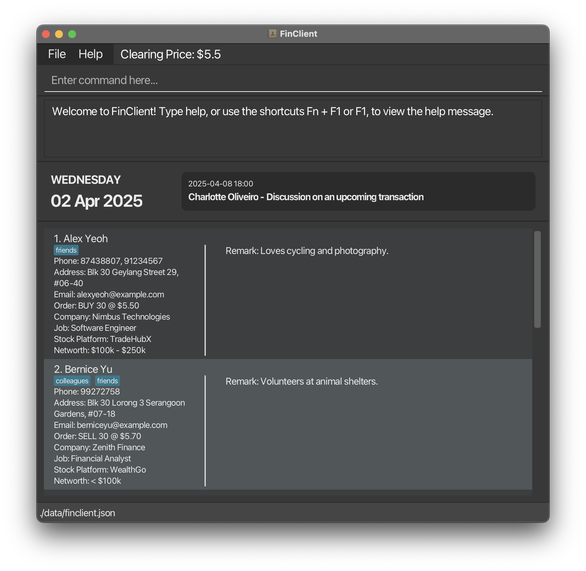
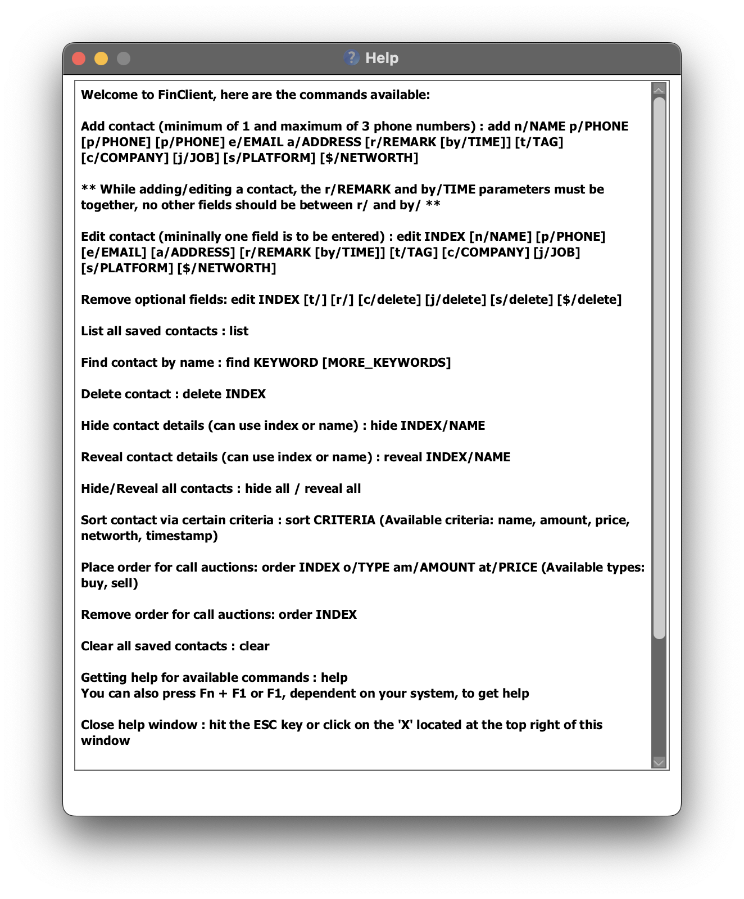

# User Guide

Welcome Financial Advisors! This guide will help you get started with FinClient.

FinClient is Command-Line Interface(CLI), or simply put, a typing-based application, that is built to help you manage your contacts and their financial details, while minimizing the time and effort spent on doing so! 

With specific features such as:

* Adding and deleting contacts
* Editing your contact's details
* Locating your contact's by name
* Maintaining contact-specific details such as jobs and their workplaces
* Sorting your contacts by name, networth, order prices and amounts
* Hiding and revealing contacts
* Order and Call Auction function

You can look forward to an efficient and enjoyable experience with FinClient!

## Table of Contents
- [Quick start](#quick-start)
- [Features](#features)
  - [Viewing help](#viewing-help)
  - [Adding a person](#adding-a-person)
  - [Listing all persons](#listing-all-persons)
  - [Editing a person](#editing-a-person)
  - [Locating persons by name](#locating-persons-by-name)
  - [Deleting a person](#deleting-a-person)
  - [Hiding a person](#hiding-a-person)
  - [Revealing a person](#revealing-a-person)
  - [Adding remarks](#adding-remarks)
  - [Sorting contacts](#sorting-contacts)
  - [Clearing all entries](#clearing-all-entries)
  - [Exiting the program](#exiting-the-program)
  - [Saving the data](#saving-the-data)
  - [Editing the data file](#editing-the-data-file)
  - [Archiving data files](#archiving-data-files)
- [FAQ](#faq)
- [Known issues](#known-issues)
- [Command summary](#command-summary)

--------------------------------------------------------------------------------------------------------------------

## Quick start

1. Ensure you have Java `17` or above installed in your Computer. 
   **Mac users:** Ensure you have the precise JDK version prescribed [here](https://se-education.org/guides/tutorials/javaInstallationMac.html).

1. Download the latest `.jar` file from [here](https://github.com/AY2425S2-CS2103T-T11-4/tp/releases).

1. Copy the file to the folder you want to use as the _home folder_ for your FinClient.

1. Open a command terminal, `cd` into the folder you put the jar file in, and use the `java -jar finclient.jar` command to run the application. 
   A GUI similar to the below should appear in a few seconds. Note how the app contains some sample data. 
   

1. Type the command in the command box and press Enter to execute it. e.g. typing **`help`** and pressing Enter will open the help window. 
   Some example commands you can try:

   * `list` : Lists all contacts.

   * `add n/John Doe p/98765432 e/johnd@example.com a/John street, block 123, #01-01` : Adds a contact named `John Doe` to the Address Book.

   * `delete 3` : Deletes the 3rd contact shown in the current list.

   * `clear` : Deletes all contacts.

   * `exit` : Exits the app.

1. Please refer to the [Features](#features) below for details of each command.

--------------------------------------------------------------------------------------------------------------------

## Features

**:information_source: Notes about the command format:** 

* Words in `UPPER_CASE` are the parameters to be supplied by the user. 
  e.g. in `add n/NAME`, `NAME` is a parameter which can be used as `add n/John Doe`.

* Items in square brackets are optional. 
  e.g `n/NAME [t/TAG]` can be used as `n/John Doe t/friend` or as `n/John Doe`.

* Items with `…`​ after them can be used multiple times including zero times. 
  e.g. `[t/TAG]…​` can be used as ` ` (i.e. 0 times), `t/friend`, `t/friend t/family` etc.

* Parameters can be in any order. 
  e.g. if the command specifies `n/NAME p/PHONE_NUMBER`, `p/PHONE_NUMBER n/NAME` is also acceptable.

* Extraneous parameters for commands that do not take in parameters (such as `help`, `list`, `exit` and `clear`) will be ignored. 
  e.g. if the command specifies `help 123`, it will be interpreted as `help`.

* If you are using a PDF version of this document, be careful when copying and pasting commands that span multiple lines as space characters surrounding line-breaks may be omitted when copied over to the application.

### Viewing help : `help`

Shows a message explaning how to access the help page.

Format: `help`

### Adding a person : `add`

Adds a person to FinClient.

Format: `add n/NAME p/PHONE_NUMBER [p/PHONE_NUMBER] [p/PHONE_NUMBER] e/EMAIL a/ADDRESS r/REMARKS [t/TAG]…​ [c/COMPANY] [j/job] [s/STOCKPLATFORM] [$/NETWORTH]`

:bulb: **Tip:**
A person can have any number of tags (including 0) 
:bulb: **Tip:**
Optional fields can be left out when adding a person's contact.

Examples:
* `add n/Betsy Crowe t/friend e/betsycrowe@example.com a/Newgate Prison p/1234567 r/10 year sentence t/criminal `

### Listing all persons : `list`

Shows a list of all persons in FinClient.

Format: `list`

### Editing a person : `edit`

Edits an existing person in FinClient.

Format: `edit INDEX [n/NAME] [p/PHONE] [e/EMAIL] [a/ADDRESS] [r/REMARK] [t/TAG]…​ [c/COMPANY] [j/job] [s/STOCKPLATFORM] [$/NETWORTH]`

* Edits the person at the specified `INDEX`. The index refers to the index number shown in the displayed person list. The index **must be a positive integer** 1, 2, 3, …​
* At least one of the optional fields must be provided.
* Existing values will be updated to the input values.
* When editing tags, the existing tags of the person will be removed i.e adding of tags is not cumulative.
* You can remove all the person’s tags by typing `t/` without
    specifying any tags after it.
* For the optional fields of company, job, stock platform and networth, you can remove the existing value by typing their prefix followed with a delete.

Examples:
*  `edit 1 p/91234567 e/johndoe@example.com` Edits the phone number and email address of the 1st person to be `91234567` and `johndoe@example.com` respectively.
*  `edit 2 n/Betsy Crower t/` Edits the name of the 2nd person to be `Betsy Crower` and clears all existing tags.
*  `edit 2 j/delete c/LittleStartUp s/delete $/delete` Edits the job of the 2nd person to be `LittleStartUp` and clears the existing job, stock platform and networth.

### Locating persons by tag: `tag`

Finds persons whose tags contain any of the given

### Locating persons by name: `find`

Finds persons whose names contain any of the given keywords.

Format: `find KEYWORD [MORE_KEYWORDS]`

* The search is case-insensitive. e.g `hans` will match `Hans`
* The order of the keywords does not matter. e.g. `Hans Bo` will match `Bo Hans`
* Only the name is searched.
* Only full words will be matched e.g. `Han` will not match `Hans`
* Persons matching at least one keyword will be returned (i.e. `OR` search).
  e.g. `Hans Bo` will return `Hans Gruber`, `Bo Yang`

Examples:
* `find John` returns `john` and `John Doe`
* `find alex david` returns `Alex Yeoh`, `David Li` 
  

### Deleting a person : `delete`

Deletes the specified person from FinClient.

Format: `delete INDEX`

* Deletes the person at the specified `INDEX`.
* The index refers to the index number shown in the displayed person list.
* The index **must be a positive integer** 1, 2, 3, …​

Examples:
* `list` followed by `delete 2` deletes the 2nd person in FinClient.
* `find Betsy` followed by `delete 1` deletes the 1st person in the results of the `find` command.

### Hiding a person : `hide`

Hides the details of the specified person in FinClient.

Format: `hide all|INDEX|name`

* Hides the details of the person specified at `INDEX` or by `name`.
* Hides all contacts' details if `all` is used.
* The index **must be a positive integer** 1, 2, 3, …​

Examples:
* `list` followed by `hide 2` hides the 2nd person in FinClient.
* `find Betsy` followed by `hide 1` hides the 1st person in the results of the `find` command.

### Revealing a person : `reveal`

Reveals the details of the specified person in FinClient.

Format: `reveal all|INDEX|name`

* Reveals the details of the person specified at `INDEX` or by `name`.
* Reveals all contacts' details if `all` is used.
* The index **must be a positive integer** 1, 2, 3, …​

Examples:
* `list` followed by `reveal 2` reveals the 2nd person in FinClient.
* `find Betsy` followed by `reveal 1` reveals the 1st person in the results of the `find` command.

### Adding remarks: `remark`

Adds a remark to the specified person in FinClient.

Format: `remark INDEX r/[REMARKS]`

* Adds a remark to the person specified at `INDEX`

Examples:
* `remark 1 r/this is a test remark` adds `this is a test remark` to the remark section of the contact listed at index 1

### Sorting contacts: `sort`

Sorts the contact list based on the criteria of name or phone number.

Format: `sort CRITERIA`

Examples:
* `sort name` sorts the contact list in FinClient based on contact's name
* `sort networth` sorts the contact list in FinClient based on contact's networth bracket
* `sort amount` sorts the contact list in FinClient based on contact's order amount
* `sort price` sorts the contact list in FinClient based on contact's order price

### Clearing all entries : `clear`

Clears all entries from the address book.

Format: `clear`

### Exiting the program : `exit`

Exits the program.

Format: `exit`

### Saving the data

FinClient data are saved in the hard disk automatically after any command that changes the data. There is no need to save manually.

### Editing the data file

FinClient data are saved automatically as a JSON file `[JAR file location]/data/finclient.json`. Advanced users are welcome to update data directly by editing that data file.

:exclamation: **Caution:**
If your changes to the data file makes its format invalid, FinClient will discard all data and start with an empty data file at the next run. Hence, it is recommended to take a backup of the file before editing it. 
Furthermore, certain edits can cause FinClient to behave in unexpected ways (e.g., if a value entered is outside of the acceptable range). Therefore, edit the data file only if you are confident that you can update it correctly.

### Archiving data files `[coming in v2.0]`

_Details coming soon ..._

--------------------------------------------------------------------------------------------------------------------

## FAQ

**Q**: How do I transfer my data to another Computer? 
**A**: Install the app in the other computer and overwrite the empty data file it creates with the file that contains the data of your previous FinClient home folder.

--------------------------------------------------------------------------------------------------------------------

## Known issues

1. **When using multiple screens**, if you move the application to a secondary screen, and later switch to using only the primary screen, the GUI will open off-screen. The remedy is to delete the `preferences.json` file created by the application before running the application again.
2. **If you minimize the Help Window** and then run the `help` command (or use the `Help` menu, or the keyboard shortcut `F1`) again, the original Help Window will remain minimized, and no new Help Window will appear. The remedy is to manually restore the minimized Help Window.

--------------------------------------------------------------------------------------------------------------------

## Command summary

 Action | Format, Examples
------------|--------------------------------------------------------------------------------------------------------------------------------------------------------------------------------------------------
 **Add** | `add n/NAME p/PHONE_NUMBER [p/PHONE_NUMBER] [p/PHONE_NUMBER] e/EMAIL a/ADDRESS [r/REMARK] [t/TAG]…​ [c/COMPANY] [j/job] [s/STOCKPLATFORM] [$/NETWORTH] `   e.g., `add n/James Ho p/22224444 e/jamesho@example.com a/123, Clementi Rd, 1234665 t/friend t/colleague`
 **Clear** | `clear`
 **Delete** | `delete INDEX`  e.g., `delete 3`
 **Edit** | `edit INDEX [n/NAME] [p/PHONE_NUMBER] [e/EMAIL] [a/ADDRESS] [r/REMARK] [t/TAG]…​ [c/COMPANY] [j/job] [s/STOCKPLATFORM] [$/NETWORTH] `  e.g.,`edit 2 n/James Lee e/jameslee@example.com`
 **Find** | `find KEYWORD [MORE_KEYWORDS]`  e.g., `find James Jake`
 **Hide** | `hide all` or `hide INDEX` or `hide name`
 **Reveal** | `reveal all` or `reveal INDEX` or `reveal name`
 **Sort** | `sort CRITERIA`   e.g., `sort name` or `sort networth` or `sort price` or sort `sort amount`
 **Order** | `order INDEX o/TYPE am/AMOUNT at/PRICE`   e.g., `order 1 o/buy am/5 at/5.50`
 **List** | `list`
 **Help** | `help`
